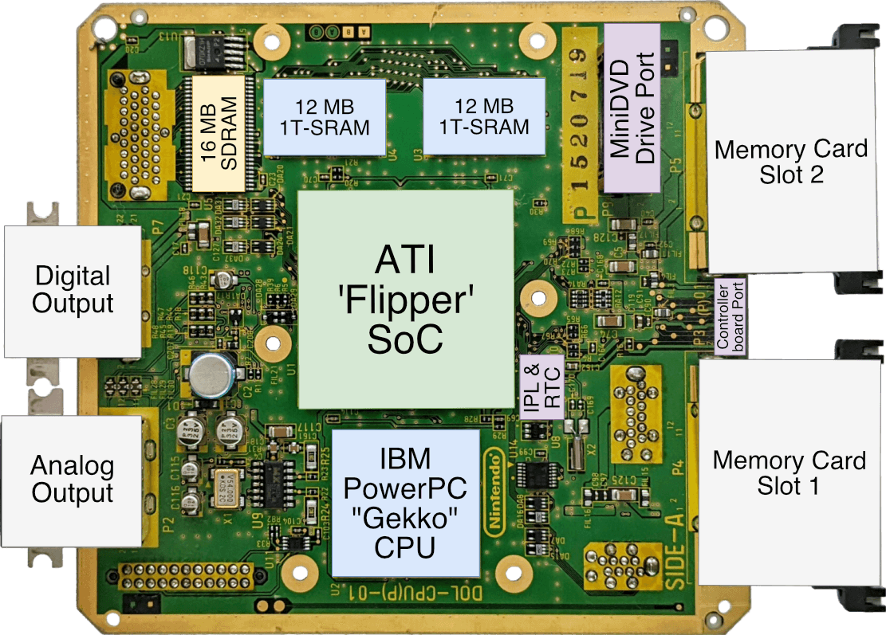
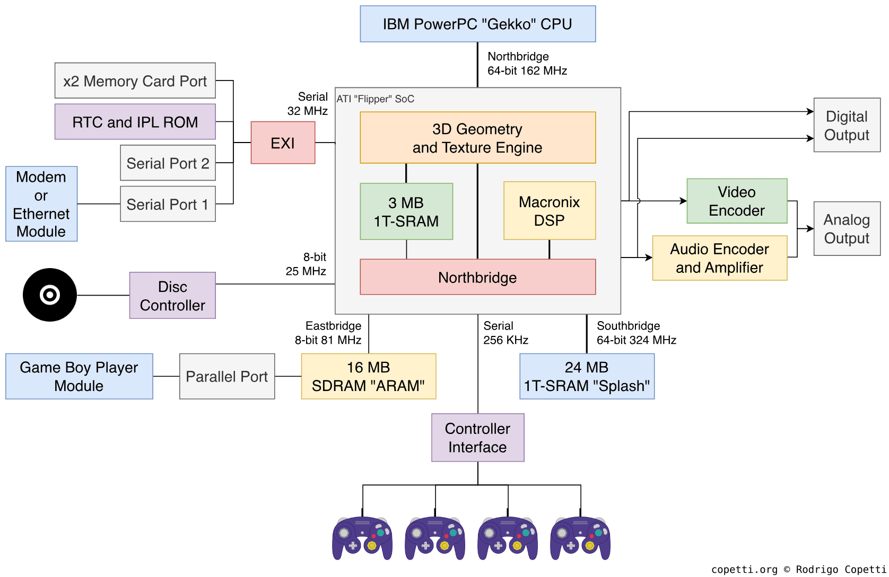

# Hardware

## Memory: 43 MiB total

- RAM: 24 MiB (2 x 12 MiB) 1T-SRAM[^1tsram] running at 324 MHz (CPU / 1.5) (Flipper \* 2)
- VRAM: 3 MiB 1T-SRAM[^1tsram] memory embedded within Flipper, 2 MiB for framebuffers and 1 MiB
  for textures
- ARAM: 16 MiB DRAM connected to Flipper, used as Auxiliary RAM, usually for audio

[^1tsram]:
    A kind of pseudo-static RAM (PSRAM). Internally it's just DRAM, but it's made to behave
    like SRAM from an outside point of view.

## DVD Reader

- Reads miniDVD sized Nintendo optical discs
- Discs are 1.46 GiB, read at constant angular velocity (in practice, this means data in the outer
  part of the disc is read faster than data in the inner part)

## Motherboard

Here's an overview of the GameCube's motherboard, with the some important components labeled:

Image by Rodrigo Copetti, 
<a href="resources.html#gamecube-architecture---a-pratical-analysis">Gamecube Architecture - A Pratical Analysis</a>

And here's a diagram of the architecture:

Image by Rodrigo Copetti, 
<a href="resources.html#gamecube-architecture---a-pratical-analysis">Gamecube Architecture - A Pratical Analysis</a>

A note on buses:

- Northbridge: Connects the CPU to the Flipper. It is 64-bit and runs on the Flipper clock.
- Southbridge: Connects both 12 MiB 1T-SRAM chips to the Flipper. It is 64-bit and runs at double
  the Flipper clock.
- Eastbridge: Connects ARAM to the Flipper. It is 8-bit and runs at half the Flipper clock.
