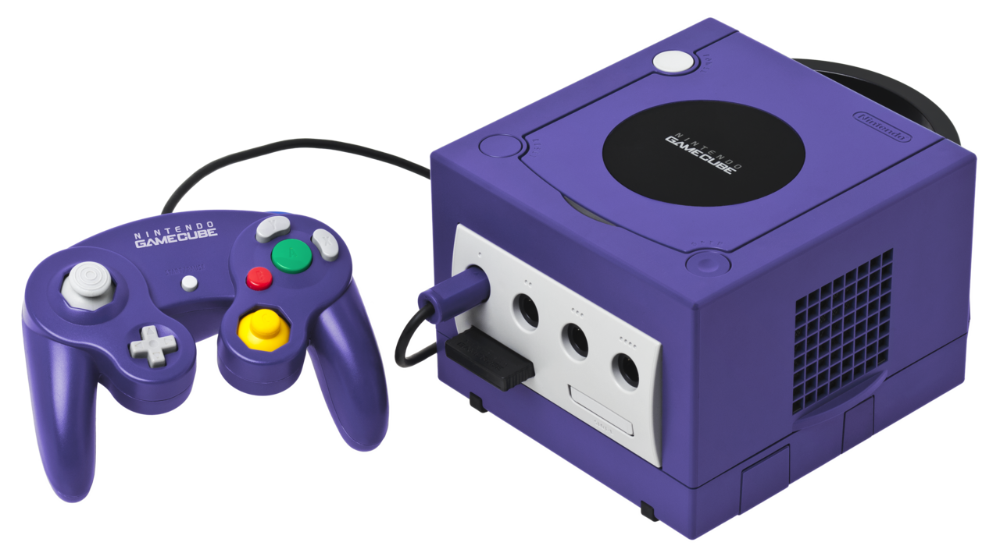

# Overview

The Nintendo GameCube is a console released in 2001/2002 and is the successor to the Nintendo 64. It
belongs to the sixth generation of consoles, together with others like Sony's Playstation 2 and 
Microsoft's Xbox.

While the GameCube is frequentely overshadowed by it's big brother, the Nintendo Wii, it is a very
charming console, powerful for it's time.